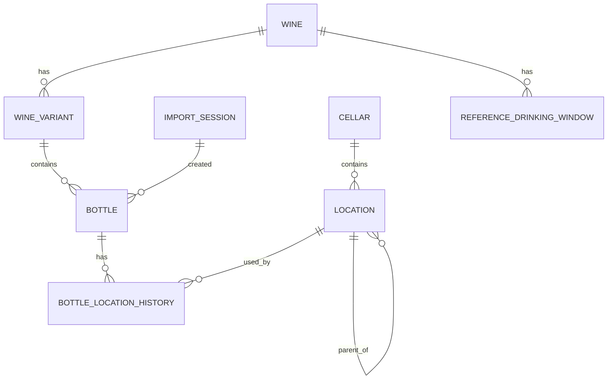

# Database model

CellarMind uses SQLite as its source of truth.

CSV files are import/export formats. Once data has been imported, the application works from the database, not from the original CSV file.

## Core relationship

```text
Wine
  -> WineVariant
      -> Bottle
```

A `Wine` is the identity of a wine.

A `WineVariant` is the format-specific version of that wine.

A `Bottle` is one physical bottle owned by the user.

## Implemented entity overview



## Wine

A `Wine` represents identity, independently from physical stock and bottle format.

Current identity fields:

```text
id
producer
cuvee
vintage
appellation
color
created_at
updated_at
```

The minimum identity is:

```text
producer + cuvee + vintage + appellation + color
```

`vintage` is stored as text. Missing/non-vintage wines are normalized to `NV`.

Format does not belong to `Wine`; it belongs to `WineVariant`.

## WineVariant

A `WineVariant` represents a specific format of a `Wine`.

Current fields:

```text
id
wine_id
format
personal_drink_from_year
personal_drink_until_year
created_at
updated_at
```

Examples:

```text
750ml
1500ml
3000ml
```

CellarMind does not store `volume_ml` separately in v0.1. The canonical string is the stored format.

Personal drinking windows are stored on `WineVariant`:

```text
personal_drink_from_year
personal_drink_until_year
```

They represent the user's own estimates, usually imported from the cellar spreadsheet.

They are intentionally separate from reference and AI evidence.

## Bottle

A `Bottle` represents one physical bottle.

Current conceptual fields:

```text
id
wine_variant_id
status
import_session_id
purchase_price
created_at
updated_at
```

`quantity` is not a database field on `Bottle`.

A CSV row with `Nb = 3` creates three physical `Bottle` rows.

A CSV row with `Nb = 0` creates no physical bottles.

`bottle.purchase_price` stores the imported purchase price per physical bottle.

Supported statuses:

```text
in_cellar
opened
consumed
gifted
sold
lost
```

When a bottle leaves the cellar, CellarMind closes its active location history row.

Opened bottles keep their active location.

## ImportSession

An `ImportSession` records a CSV import or manual bottle addition.

Current conceptual fields:

```text
id
source_file
source_hash
imported_at
row_count
created_bottle_count
notes
```

Manual additions are recorded through an `ImportSession` with a manual source.

## Cellar

A `Cellar` represents a physical storage place.

Cellars can have a functional profile:

```text
purpose
capacity_estimate
capacity_warning_threshold
notes
```

Supported purposes:

```text
aging
drink_soon
mixed
staging
overflow
```

Cellar profiles are used by placement reporting, transfer planning, and drinking recommendations.

Capacity remains advisory. It does not block imports or moves.

## Location

A `Location` represents a place inside a cellar.

Current conceptual fields:

```text
id
cellar_id
parent_location_id
name
notes
created_at
updated_at
```

Locations may be flat or hierarchical.

## BottleLocationHistory

A bottle can move over time.

The current location is the active location history row where:

```text
ended_at IS NULL
```

Conceptual fields:

```text
id
bottle_id
location_id
started_at
ended_at
notes
created_at
updated_at
```

CellarMind does not store a direct `location_id` on `Bottle`. Location is derived from history.

When a bottle moves:

```text
1. close the current active BottleLocationHistory row
2. insert a new active BottleLocationHistory row
```

When a bottle leaves the cellar:

```text
1. update Bottle.status
2. close the active BottleLocationHistory row
```

## ReferenceDrinkingWindow

`reference_drinking_window` stores manual, fetched, or AI-generated drinking-window evidence.

It is linked to `Wine`, not `WineVariant`.

Current conceptual fields:

```text
id
wine_id
source_name
source_url
drink_from_year
drink_until_year
confidence
notes
created_at
```

`confidence` values:

```text
low
medium
high
```

At least one of `drink_from_year` or `drink_until_year` must be present.

If both are present, `drink_from_year` must be less than or equal to `drink_until_year`.

### Manual reference windows

Manual references are added with `reference-window add`.

### Internet-extracted reference windows

`reference-window fetch` can extract a candidate reference drinking window from a source URL.

The `notes` field includes extracted evidence.

### Search results

`reference-window search` finds candidate source pages.

Search results are not stored unless the user explicitly saves a fetched or manually added window.

### AI estimates

AI drinking-window estimates are also stored in `reference_drinking_window` as reference evidence.

OpenAI estimates use:

```text
source_name = "AI estimate (OpenAI)"
source_url = NULL
```

Local Ollama estimates use:

```text
source_name = "AI estimate (local)"
source_url = NULL
```

The `notes` field records:

```text
provider
model
web-search status
web reader
token usage when available
rationale
returned sources
gathered evidence
```

AI estimates remain advisory reference evidence. They do not overwrite `WineVariant.personal_drink_from_year` or `WineVariant.personal_drink_until_year`.

## Window comparison

Window comparison uses:

```text
WineVariant.personal_drink_from_year
WineVariant.personal_drink_until_year
ReferenceDrinkingWindow.drink_from_year
ReferenceDrinkingWindow.drink_until_year
```

The comparison report is read-only.

## Placement auditing

Placement auditing uses:

```text
Bottle.status
Bottle active location
Cellar.purpose
Cellar capacity hints
WineVariant.personal_drink_from_year
WineVariant.personal_drink_until_year
```

It detects advisory issues such as:

- active bottles without location
- bottles in staging or overflow cellars
- young bottles in a `drink_soon` cellar
- ready or overdue bottles in an `aging` cellar
- cellars near or over approximate capacity

## CSV import behavior

The import flow is:

```text
CSV
  -> validate
  -> normalize
  -> create ImportSession
  -> create or reuse Wine
  -> create or reuse WineVariant
  -> create Bottle rows
  -> create initial BottleLocationHistory rows
```

Minimum import fields:

```text
producer
cuvee
vintage
appellation
color
```

Optional import fields:

```text
format
quantity
cellar
location
purchase_price
personal_drink_from_year
personal_drink_until_year
notes
```

Import rules:

- missing `format` defaults to `750ml`
- missing `quantity` defaults to `1`
- `quantity` must be greater than or equal to `0`
- `quantity = 0` creates no bottles
- `format` creates or reuses a `WineVariant`
- `cellar` creates or reuses a `Cellar`
- `location` creates or reuses a `Location`
- imported bottles are attached to an `ImportSession`

## Future model ideas

These are not required for the current implementation, but the current model leaves room for them:

```text
Tasting
PriceObservation
richer format metadata
provider-specific evidence tables
undo/rollback by ImportSession
```

A future dedicated `Evidence` table may be useful if reference/AI evidence becomes too rich for `reference_drinking_window.notes`.

A future dedicated `DrinkWindow` table may be useful if CellarMind needs versioned computed windows per `WineVariant`.

For now, the implemented distinction is:

```text
personal window = WineVariant fields
reference/AI evidence = reference_drinking_window rows
```
