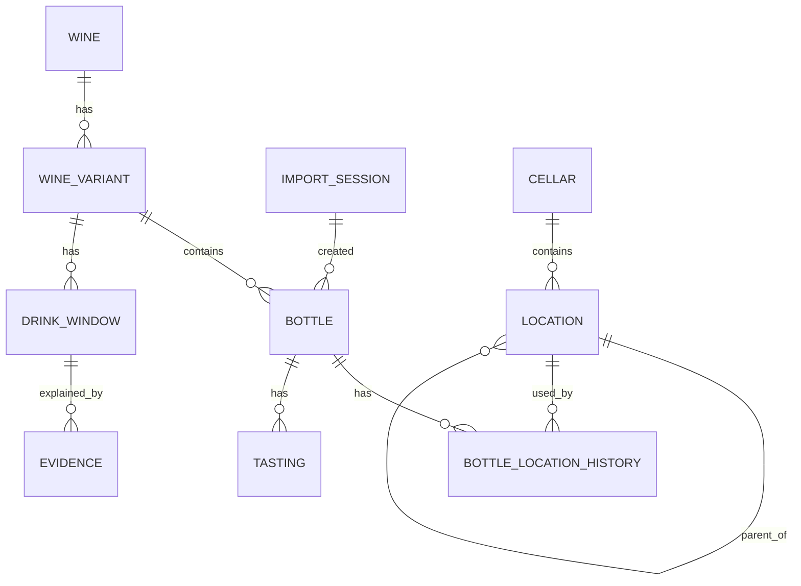

# Database Model

CellarMind uses SQLite as its source of truth.

CSV files are only import/export formats. Once data has been imported, the application works from the database, not from the original CSV file.

This document describes the target database model and the business reasoning behind it.

## Design goals

The database model should support:

- importing existing cellar inventories from CSV or Excel;
- distinguishing wine identity from physical bottles;
- supporting multiple bottle formats for the same wine;
- tracking where each physical bottle is stored;
- preserving location history;
- enriching wines with drinking windows and evidence;
- recording tastings;
- supporting future reports, search, and recommendations.

The model should stay simple for v0.1, but it must not block future features.

## Core relationship

The central relationship is:

```text
Wine
  -> WineVariant
    -> Bottle
```

This is one of the most important decisions in CellarMind.

A `Wine` is the identity of a wine.

A `WineVariant` is a version of that wine that may age differently, mainly because of its format.

A `Bottle` is one physical bottle owned by the user.

## Entity overview



## Wine

A `Wine` represents the identity of a wine, independently from physical stock and bottle format.

Examples:

```text
Domaine Castagnier — Clos Vougeot Grand Cru — 2022 — Rouge
Louis Boillot — Moulin-à-Vent Les Rouchaux — 2018 — Rouge
```

A `Wine` does not have a bottle format.

Conceptually, the format does not belong to the wine identity. It belongs to the variant layer.

Suggested fields:

```text
id
producer
cuvee
vintage
appellation
color
country
region
created_at
updated_at
```

### Required fields

For v0.1, the minimum identity is:

```text
producer
cuvee
vintage
appellation
color
```

### Optional fields

Additional fields may be added later:

```text
country
region
subregion
classification
grape_varieties
```

### Uniqueness

A suggested uniqueness rule is:

```text
producer + cuvee + vintage + appellation + color
```

This may evolve later if the project needs stronger normalization for producers, appellations, or regions.

## WineVariant

A `WineVariant` represents a specific version of a `Wine` that may affect ageing, pricing, or enrichment results.

For v0.1, the only variant dimension is `format`.

Examples:

```text
Domaine Castagnier — Clos Vougeot Grand Cru — 2022 — 750ml
Domaine Castagnier — Clos Vougeot Grand Cru — 2022 — 1500ml
Domaine Test — Cuvée Test — 2020 — 500ml
```

Suggested fields:

```text
id
wine_id
format
personal_drink_from_year
personal_drink_until_year
created_at
updated_at
```

### Format

`format` is stored as a canonical string.

Examples:

```text
375ml
500ml
750ml
1500ml
3000ml
6000ml
```

Default value:

```text
750ml
```

Accepted import aliases may include:

```text
bottle       -> 750ml
standard     -> 750ml
half         -> 375ml
half_bottle  -> 375ml
50cl         -> 500ml
500ml        -> 500ml
75cl         -> 750ml
750ml        -> 750ml
magnum       -> 1500ml
150cl        -> 1500ml
1500ml       -> 1500ml
jeroboam     -> 3000ml
imperial     -> 6000ml
```

CellarMind does not store `volume_ml` separately in v0.1.

This keeps the model simple while still supporting explicit formats such as `500ml`.

A future schema version may introduce richer format metadata if regional or non-standard bottle names become important.

### Personal drinking window

`wine_variant.personal_drink_from_year` and
`wine_variant.personal_drink_until_year` store the user's own drinking-window
estimate for a wine variant.

These values come from imported cellar data, for example `Année min` and
`Année Max`.

They are intentionally separate from future external enrichment data. Later,
CellarMind may add provider-based drinking windows with confidence scores and
evidence.

### Drinking-window reporting

The drinking-window report uses the personal drinking-window fields stored on
`WineVariant`:

```text
personal_drink_from_year
personal_drink_until_year
```

The report evaluates active bottles against a chosen year and classifies them as:

```text
overdue
ready
too_young
unknown
```

The report is read-only and does not modify bottles, locations, or drinking
windows.

### Uniqueness

A suggested uniqueness rule is:

```text
wine_id + format
```

Several physical bottles may point to the same `WineVariant`.

## Bottle

A `Bottle` represents one physical bottle.

Several bottles can refer to the same `WineVariant`.

Suggested fields:

```text
id
wine_variant_id
status
import_session_id
purchase_date
purchase_price
purchase_currency
notes
created_at
updated_at
```

### Status

Suggested initial statuses:

```text
in_cellar
opened
consumed
sold
gifted
broken
missing
```

Only bottles with status `in_cellar` should usually appear in the active inventory.

### Quantity

`quantity` is not a database field on `Bottle`.

It is an import convenience.

A CSV row with:

```text
quantity = 3
```

creates three `Bottle` records linked to the same `WineVariant`.

This is important because each physical bottle may later have:

- a different location;
- a different opening date;
- a different tasting note;
- a different status.

### Purchase price

`bottle.purchase_price` stores the imported purchase price per physical bottle.

If a CSV row has `Nb = 3` and `Prix = 42`, CellarMind creates three `Bottle`
rows and each bottle receives `purchase_price = 42`.

The field is nullable because purchase price may be unknown.

### Manual bottle additions

Manual additions create physical `Bottle` rows directly from CLI input.

A manual addition still follows the same model as CSV import:

```text
Wine
  -> WineVariant
      -> Bottle
```

The command creates or reuses the matching `Wine` and `WineVariant`, then creates
one `Bottle` row per requested quantity.

If a cellar and location are provided, CellarMind creates active
`BottleLocationHistory` rows for the new bottles.

Manual additions are recorded through an `ImportSession` with source `manual`.

## ImportSession

An `ImportSession` records an import operation.

Suggested fields:

```text
id
source_file
source_hash
imported_at
row_count
created_bottle_count
notes
```

The goal is to trace where imported bottles came from.

Example use cases:

```text
Show all bottles imported from cave.csv on 2026-07-03
Undo a recent import
Compare two imports
Audit duplicate rows
```

For v0.1, import sessions should at least record the imported filename and the number of created bottles.

A future version may support rollback/undo at the import session level.

## Cellar

A `Cellar` represents a physical storage place.

Examples:

```text
Home cellar
External storage
Holiday house
Professional storage
```

Suggested fields:

```text
id
name
notes
created_at
updated_at
```

A user may have multiple cellars.

### Cellar profile

A cellar has a functional profile:

```text
purpose
capacity_estimate
capacity_warning_threshold
notes
```

And the following purposes are supported:

```text
aging
drink_soon
mixed
staging
overflow
```

### Placement auditing

Cellar profiles are used by the placement report.

The report compares:

```text
Bottle active location
Bottle status
Cellar purpose
Cellar approximate capacity
WineVariant personal drinking window
```

This allows CellarMind to detect advisory placement issues such as:

- active bottles without location;
- bottles in staging or overflow cellars;
- young bottles in a `drink_soon` cellar;
- ready or overdue bottles in an `aging` cellar;
- cellars near or over their approximate capacity.

Capacity remains advisory. The report highlights possible issues but does not
block imports, moves, or manual additions.

## Plan cellar transfers

After running the placement report, CellarMind can turn placement issues into a
dry-run transfer plan.

```bash
uv run cellarmind plan transfers \
  --database data/cellarmind.sqlite \
  --year 2026 \
  --limit 30
```

The plan is advisory. It suggests target cellars when possible, but it does not
assign exact physical slots and does not apply moves.

Typical suggestions include:

- moving too-young bottles from `drink_soon` cellars to `aging` cellars;
- moving ready or overdue bottles from `aging` cellars to `drink_soon` cellars;
- reviewing bottles in `staging` or `overflow` cellars;
- reviewing bottles without an active location.

## Location

A `Location` represents a place inside a cellar.

Locations can be flat or hierarchical.

Examples:

```text
Rack A
Shelf 3
Case 12
Rack A / Shelf 3 / Slot 5
```

Suggested fields:

```text
id
cellar_id
parent_location_id
name
notes
created_at
updated_at
```

### Hierarchical locations

`parent_location_id` allows flexible storage structures.

Example:

```text
Home cellar
  -> Rack A
    -> Shelf 3
      -> Slot 5
```

The first implementation may keep location as a simple free-text value, but the database model should not prevent hierarchical locations later.

## BottleLocationHistory

A bottle can move over time.

The current location is the active location history row where `ended_at` is null.

Suggested fields:

```text
id
bottle_id
location_id
started_at
ended_at
notes
created_at
updated_at
```

CellarMind should not store `location_id` directly on `Bottle`.

This preserves movement history.

Example:

```text
Bottle 123
  2024-01-01 -> Home cellar / Rack A
  2025-08-15 -> External storage / Case 12
```

Only one active location should exist for a bottle at a given time.

### Moving bottles

Bottle movement is represented by location history.

When a bottle moves, CellarMind does not update a `location_id` directly on the
`bottle` table. Instead it closes the current active `BottleLocationHistory` row
by setting `ended_at`, then inserts a new active row for the target location.

A bottle should have at most one active location history row, identified by:

```text
ended_at IS NULL
```

### Bottle status

`bottle.status` tracks the lifecycle state of a physical bottle.

Supported statuses are:

```text
in_cellar
opened
consumed
gifted
sold
lost
```

### Status changes and active locations

When a bottle leaves the cellar, CellarMind does not delete its location history.

Instead, it closes the active location row:

```text
ended_at = CURRENT_TIMESTAMP
```

## DrinkWindow

A `DrinkWindow` represents the estimated maturity window of a `WineVariant`.

It belongs to `WineVariant`, not to `Wine`, because format affects ageing.

Suggested fields:

```text
id
wine_variant_id
drink_from
peak_year
drink_until
confidence
method
created_at
updated_at
```

Examples:

```text
drink_from = 2028
peak_year = 2035
drink_until = 2045
```

### Method

Suggested `method` values:

```text
exact_vintage
nearby_vintage
same_cuvee
producer_guidance
critic_consensus
community_consensus
appellation_interpolation
producer_style_interpolation
manual_override
```

### Multiple versions

The initial implementation may keep only one active `DrinkWindow` per `WineVariant`.

A future version may keep historical drink windows when new evidence changes the recommendation.

## Evidence

An `Evidence` record explains why a drinking window was chosen.

Suggested fields:

```text
id
drink_window_id
source_name
source_url
source_type
confidence
notes
retrieved_at
created_at
```

Examples of `source_type`:

```text
producer
critic
merchant
community
manual
interpolation
```

Every enrichment result should be explainable through evidence.

If no direct source is found, the evidence should explicitly say how the interpolation was made.

Example:

```text
source_type = interpolation
notes = Interpolated from the same appellation, nearby vintages and producer style.
```

## Tasting

A `Tasting` represents one tasting event.

It belongs to a physical `Bottle`, not to a `Wine`.

Suggested fields:

```text
id
bottle_id
tasted_at
rating
notes
created_at
updated_at
```

A user opens and tastes a specific physical bottle.

This matters because two bottles of the same wine may evolve differently depending on storage, cork condition, bottle variation, or format.

Future tasting fields may include:

```text
maturity_assessment
aroma_notes
food_pairing
would_drink_again
adjust_remaining_bottles
```

## Price and valuation

For v0.1, purchase information can live on `Bottle`:

```text
purchase_date
purchase_price
purchase_currency
```

Market valuation is not part of the initial database scope.

A future version may introduce price history.

Possible future entity:

```text
PriceObservation
  id
  wine_variant_id
  observed_at
  source_name
  price
  currency
  notes
```

Price should probably belong to `WineVariant`, because format affects market value.

## Import behavior

The import flow is:

```text
CSV
  -> validate
  -> normalize
  -> create ImportSession
  -> create or reuse Wine
  -> create or reuse WineVariant
  -> create Bottle records
  -> create initial BottleLocationHistory records
```

### CSV fields

Minimum import fields:

```text
producer
cuvee
vintage
appellation
color
```

Optional import fields:

```text
format
quantity
cellar
location
purchase_date
purchase_price
notes
```

### Import rules

- Missing `format` defaults to `750ml`.
- Missing `quantity` defaults to `1`.
- `quantity` must be greater than or equal to `1`.
- `quantity` creates multiple `Bottle` records.
- `format` creates or reuses a `WineVariant`.
- `cellar` creates or reuses a `Cellar`.
- `location` creates or reuses a `Location`.
- imported bottles are attached to an `ImportSession`.
- if a row has no cellar or location, the bottle may be created without initial location or assigned to a default cellar depending on configuration.

### Multiple locations

If identical bottles are stored in different places, they should be represented as separate CSV rows.

Example:

```csv
producer,cuvee,vintage,appellation,color,format,quantity,cellar,location
Domaine Test,Cuvée Test,2020,Test Appellation,Rouge,750ml,2,Home cellar,Rack A
Domaine Test,Cuvée Test,2020,Test Appellation,Rouge,750ml,1,External storage,Case 12
```

This creates three physical bottles:

```text
2 bottles in Home cellar / Rack A
1 bottle in External storage / Case 12
```

### Zero quantity rows

A CSV row with `Nb = 0` is accepted but creates no physical `Bottle` rows.

This represents a historical or already-consumed/opened entry in the source CSV.
CellarMind keeps the import valid but does not create inventory for bottles that
are no longer present.

## Deletion and history

The database should avoid destructive deletion for user data.

For example:

- consumed bottles should be marked as `consumed`;
- sold bottles should be marked as `sold`;
- lost bottles should be marked as `lost`.

Hard deletion may exist for development or explicit cleanup, but normal user actions should preserve history.

## Timestamps

Most tables should include:

```text
created_at
updated_at
```

History tables may include domain-specific timestamps:

```text
started_at
ended_at
tasted_at
imported_at
retrieved_at
```

## IDs

All domain entities should use stable identifiers.

SQLite integer primary keys are acceptable for v0.1.

A future version may introduce UUIDs if synchronization, external integrations, or multi-device workflows require them.

## Suggested initial schema scope

The first database implementation should focus on:

```text
Wine
WineVariant
Bottle
Cellar
Location
BottleLocationHistory
ImportSession
```

The first import implementation should not yet require:

```text
DrinkWindow
Evidence
Tasting
PriceObservation
```

Those can be added after the import workflow is stable.

## Future extensions

Possible future entities:

```text
Producer
Appellation
Region
Country
GrapeVariety
PriceObservation
ManualOverride
FoodPairing
```

These should not be introduced too early.

The v0.1 model should keep wine identity as simple strings until there is a clear need for deeper normalization.

## Summary

The key rules are:

- `Wine` is the wine identity.
- `WineVariant` owns `format`.
- `Bottle` is one physical bottle.
- `quantity` is import-only.
- `DrinkWindow` belongs to `WineVariant`.
- `Tasting` belongs to `Bottle`.
- `Location` is tracked through history.
- SQLite is the source of truth.
- CSV is only an import/export format.
